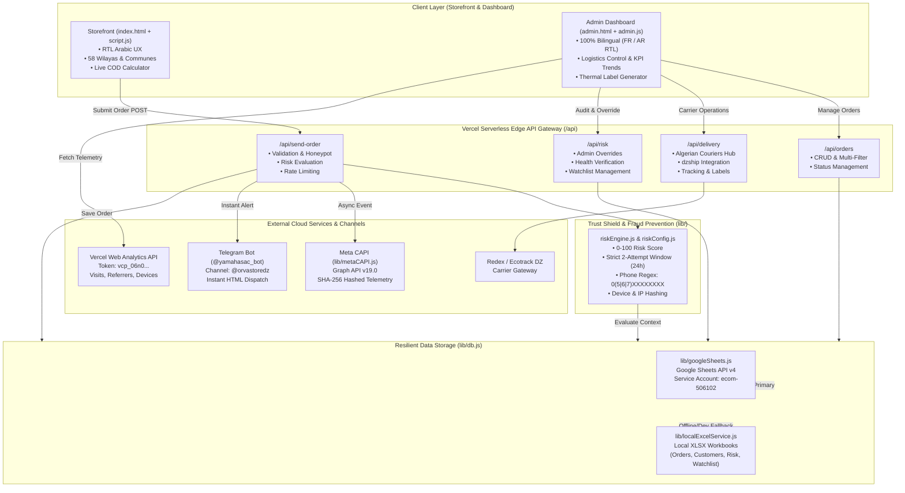

# ORVA Store (Yamaha Sac à Dos) — Comprehensive Project Report

> **Project Name:** ORVA Store — Single Product E-Commerce & Algerian Logistics Hub  
> **Repository:** `d:/Websites On Line/yamahasac`  
> **Target Market:** Algeria (58 Wilayas, Cash-On-Delivery / الدفع عند الاستلام)  
> **Primary Offer:** Yamaha Sac à Dos + Matching Sacoche + Free AirPods & Luxury Watch Bundle (4,200 DZD)  
> **Status:** Production-Ready & Deployed (Vercel Serverless Architecture)

---

## 1. Executive Summary

**ORVA Store** is a specialized, high-conversion single-product Cash-On-Delivery (COD) e-commerce platform tailored specifically for the Algerian e-commerce market. The platform combines:

1. **A High-Converting Landing Page:** Mobile-optimized, RTL Arabic storefront with live price calculation, accurate Algerian shipping rates across all 58 wilayas, commune autocompletion, and trust-building social proof.
2. **Multi-Carrier Algerian Logistics Hub:** Deep integration with Algerian couriers (Redex / Ecotrack DZ, Yalidine, ZR Express, DHD, Noest, Maystro, Anderson), printable official thermal shipping labels (Bordereaux), and tracking timelines.
3. **AI & Heuristic Anti-Fraud Engine (Trust Shield):** Real-time multi-factor risk assessment that scores each order (0–100), blocks automated bots via honeypots, prevents duplicate submissions (strict 2-order limit per phone/device/IP per 24h), and scores customer trust.
4. **Resilient Dual Data Layer:** Direct cloud synchronization with Google Sheets API v4 with seamless offline/development fallback to local Excel workbooks (`.xlsx`).
5. **Real-time Marketing & Telemetry Integrations:** Meta Conversions API (CAPI) with SHA-256 data normalization and Pixel deduplication, live Vercel Web Analytics REST API aggregation, and instant Telegram Bot dispatch with direct admin review links.

---

## 2. System Architecture



---

## 3. Core Modules & Directory Structure

```
d:/Websites On Line/yamahasac/
├── index.html               # Customer-facing high-converting COD landing page (Arabic RTL)
├── styles.css               # Storefront styling (glassmorphism, mobile-responsive, modern fonts)
├── script.js               # Storefront logic, validation, 58-wilaya pricing, order submission
├── algeria-communes.js      # Complete Algerian Communes database mapped by Wilaya ID
├── admin.html               # Enterprise Admin & Logistics Dashboard
├── admin.css                # Admin styles (Light theme, RTL switch, KPI cards, tables)
├── admin.js                 # Admin controller (Bilingual FR/AR, charts, live status updates)
├── dev-server.js            # Local full-stack Node.js server replicating Vercel edge routes
├── Tarif_Biskra.txt         # Official carrier tariff reference table for all 58 Wilayas
├── package.json             # Node dependencies and npm run scripts
├── vercel.json              # Vercel serverless rewrite rules
├── verify-sheets.js         # Cloud Google Sheets API diagnostics & verification script
├── api/
│   ├── send-order.js        # Checkout processor: honeypot, rate limits, risk, CAPI, TG alert
│   ├── orders.js            # Orders REST API: list, filter, search, update, delete
│   ├── delivery.js          # Algerian couriers API gateway (dzship, Ecotrack, Yalidine, labels)
│   └── risk.js              # Risk Shield API: evaluation lookup, manual override, watchlist
├── lib/
│   ├── db.js                # Unified database abstraction layer
│   ├── googleSheets.js      # Google Sheets API client (Service Account auth, auto-sync)
│   ├── localExcelService.js # Drop-in local XLSX storage engine matching Google Sheets schema
│   ├── riskEngine.js        # Rule-based fraud evaluation and scoring engine
│   ├── riskConfig.js        # Central configuration for risk thresholds and weights
│   ├── metaCAPI.js          # Server-side Meta Conversions API client with SHA-256 hashing
│   ├── vercelAnalytics.js   # Live Vercel Web Analytics REST client
│   └── supabaseServer.js    # Clean deprecation stub (replaced by Google Sheets/Excel)
├── scripts/
│   ├── init-local-excel.js  # Generator for initial Excel database workbooks
│   └── test-local-excel.js  # End-to-end integration test for local Excel storage
├── data/excel/              # Local storage files: Orders.xlsx, Customers.xlsx, etc.
└── images/                  # High-resolution marketing assets & product photography
```

---

## 4. Key Functional Pillars

### 4.1. Storefront Experience & Algerian Market Alignment
* **Single-Product Bundle Presentation:** Features the Yamaha motorcycle backpack plus matching compact pouch, wireless AirPods, and a luxury watch for **4,200 DZD**.
* **Strict 58 Wilayas & Communes Engine:** Real-time dynamic shipping calculation based on the origin hub in Biskra ([`Tarif_Biskra.txt`](file:///d:/Websites%20On%20Line/yamahasac/Tarif_Biskra.txt)). Supports both **Domicile (Home Delivery)** and **Stop Desk (Office Pickup)**.
* **Client-side Form Validation:** Algerian phone number verification (`05`, `06`, or `07` followed by 8 digits), instant price summary updates, quantity limiters (1 to 3 items), and interactive receipt modals.
* **Direct Communication Channels:** Floating WhatsApp button and modal with click-to-call link for customer support.

### 4.2. Logistics Hub & Algerian Carriers Gateway
* **Couriers Supported:**
  * **Ecotrack Family:** Redex Delivery DZ, DHD Express, Conexlog DZ, MSM Go Express.
  * **Independent Couriers:** Yalidine Express, ZR Express (Procolis), Noest, Maystro Delivery, Anderson Express.
* **`dzship` Integration:** Official Node.js driver for Algerian carrier parcel creation, status tracking, and label fetching.
* **Bordereau Generation:** Built-in official shipping label generator supporting thermal A6 format and standard A4 printing with barcodes, sender details, destination information, and COD amount.

### 4.3. Anti-Fraud & Risk Engine (Trust Shield)
* **Risk Scoring Model (0–100):**
  * `0 – 29` (LOW): Allowed automatically.
  * `30 – 59` (MEDIUM): Allowed with passive monitoring.
  * `60 – 79` (HIGH): Flagged as `REVIEW` in order status and Telegram alerts.
  * `80 – 100` (CRITICAL): Blocked outright (`HTTP 429`).
* **Fraud Detection Vectors:**
  * **Honeypot Trap:** Hidden field (`honeypot`) catches headless bots (+100 score).
  * **Submission Velocity:** Form fill times under 8 seconds add penalty scores (+35).
  * **Strict 24h Rate Limiting:** Enforces a hard limit of 2 orders per phone, IP, or browser device fingerprint per 24 hours.
  * **Watchlist & Trust Scoring:** Stores customer history in a dedicated `Customers` table, updating trust ratings based on successful delivery vs. cancellation/refusal.
* **Admin Overrides:** Admin can execute `trust`, `confirm`, `reject`, `block`, or `unblock` actions with audit logging in `RiskEvents`.

### 4.4. Resilient Dual Data Layer
* **Primary Cloud Storage:** Google Sheets API v4 connecting via Google Service Account ([`lib/googleSheets.js`](file:///d:/Websites%20On%20Line/yamahasac/lib/googleSheets.js)) to four standardized tabs:
  1. `Orders`: Order specifications, addresses, tracking numbers, and risk evaluations.
  2. `Customers`: Customer identity, order frequencies, and trust ratings.
  3. `RiskEvents`: Audit log of risk alerts and manual overrides.
  4. `Watchlist`: Blacklisted or monitored phones, IPs, and device hashes.
* **Local Excel Mirror:** When operating locally or when Google credentials are not set, [`lib/localExcelService.js`](file:///d:/Websites%20On%20Line/yamahasac/lib/localExcelService.js) transparently persists to `.xlsx` files in `data/excel/`, ensuring zero-config local testing.

### 4.5. Telemetry, Analytics, and Notifications
* **Meta Conversions API (CAPI):** Server-to-server purchase event tracking with SHA-256 hashed phone (`213...`), name, city, state, and browser identifiers (`_fbp`, `_fbc`), enabling Meta Ads optimization and event deduplication.
* **Vercel Web Analytics Engine:** Ingests live edge analytics via project token `vcp_06n0...` to present real-time traffic statistics, top referrers, device breakdowns, and conversion performance inside the dashboard.
* **Instant Telegram Alerts:** Generates rich HTML order notifications to channel `@orvastoredz` via `@yamahasac_bot` with direct deep-links to the order review screen in the admin dashboard.

### 4.6. Admin Dashboard (Light Edition)
* **100% Bilingual Support:** Instant toggle between French and Arabic (RTL layout) with synced translations.
* **Operational Control:** Real-time KPI summary (Total orders, COD gross revenue, pending shipments, delivered parcels, returns).
* **Interactive Charts:** 7-day order trend and top wilayas distribution powered by Chart.js.
* **Actionable Table:** Filter by status (`all`, `pending`, `shipped`, `delivered`, `returned`, `risk`), filter by wilaya, live search, and single-click parcel creation.

---

## 5. Security and Environment Configuration

| Variable | Description | Status / Note |
| :--- | :--- | :--- |
| `GOOGLE_PROJECT_ID` | GCP Project ID (`ecom-506102`) | Configured |
| `GOOGLE_CLIENT_EMAIL` | Service Account Email | Configured |
| `GOOGLE_PRIVATE_KEY` | RSA Private Key for Google Sheets API | Configured in `.env.local` |
| `GOOGLE_SHEET_ID` | Primary Spreadsheet ID | Configured |
| `ADMIN_API_TOKEN` | Bearer token protecting `/api/risk` and admin actions | Configured |
| `TELEGRAM_BOT_TOKEN` | Bot API token (`@yamahasac_bot`) | Configured |
| `TELEGRAM_CHAT_ID` | Telegram Channel ID (`-1003965560132`) | Configured |
| `ECOTRACK_API_TOKEN` | Courier token for Redex Delivery DZ | Configured |
| `META_PIXEL_ID` | Meta Pixel Identifier (`1617383883230571`) | Configured |
| `META_ACCESS_TOKEN` | Meta System User Graph API CAPI token | Configured |
| `VERCEL_TOKEN` | Project token for Vercel Web Analytics | Configured |

> [!NOTE]
> All sensitive production credentials reside in `.env.local`, which is strictly ignored by Git (`.gitignore`). Safe template variables are documented in [`.env.example`](file:///d:/Websites%20On%20Line/yamahasac/.env.example).

---

## 6. Testing & Quality Verification

* **Local Excel Storage Integration:** Tested via [`scripts/test-local-excel.js`](file:///d:/Websites%20On%20Line/yamahasac/scripts/test-local-excel.js). Confirmed read, append, update, and soft-delete operations across all local `.xlsx` files with zero runtime errors.
* **Serverless Compatibility:** All route handlers in `api/` follow Vercel Serverless Function specification (`(req, res) => ...`) with standard CORS handling and pre-flight `OPTIONS` support.
* **Git Repository State:** Clean working tree on branch `main` with a coherent commit history detailing the evolution from initial scaffold to enterprise logistics and anti-fraud activation.

---

## 7. Strategic Recommendations & Next Steps

1. **Automated Carrier Status Polling (Cron Job):**
   * *Opportunity:* Introduce a Vercel cron job to periodically poll carrier tracking endpoints (e.g. Redex/Yalidine) and automatically transition order statuses from `shipped` to `delivered` or `returned` in Google Sheets.
2. **Customer SMS Confirmation (Optional):**
   * *Opportunity:* Add an SMS gateway integration (or WhatsApp Business Cloud API) to send instant order confirmation messages with tracking links to customers immediately upon order creation.
3. **Multi-Product / Inventory Counter:**
   * *Opportunity:* Although designed as a single-product high-converting offer, an inventory threshold counter could be tied to the database to automatically display remaining stock warnings (e.g. "Only 12 pieces remaining") to drive scarcity.
